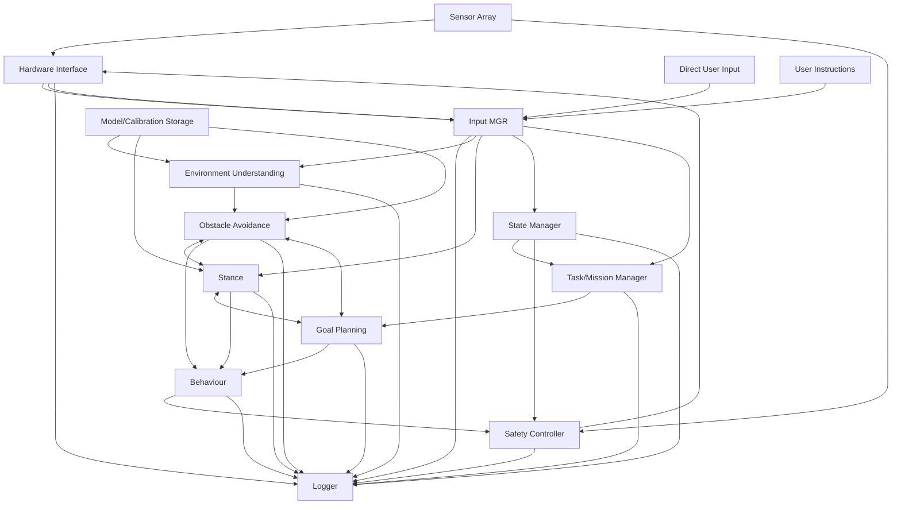

# System Architecture

The Rover Embassy Control System implements a sophisticated layered architecture with 20+ modules communicating via asynchronous channels. This page provides an overview of the system design and data flow.

## Architecture Diagram

The following diagram shows the complete system architecture and module interactions. This diagram is also available as [`diagram.mermaid`](diagram.mermaid) in the docs folder.



## Layer Overview

The system is organized into four main layers, each with specific responsibilities:

### 1. Input Layer (4 modules)

The input layer collects data from various sources:

| Module | Purpose |
|--------|---------|
| **Sensor Array** | Generates simulated sensor readings (distance, IMU, GPS, battery) |
| **Direct User Input** | Captures manual control commands from keyboard |
| **User Instructions** | Handles high-level mission commands |
| **Hardware Interface** | Manages hardware status, forwards sensor data, and executes behavior commands |

### 2. Core Processing (9 modules)

The core processing layer performs perception, planning, and state management:

| Module | Purpose |
|--------|---------|
| **Input Manager** | Central hub aggregating all input sources |
| **Logger** | System-wide logging with multiple log levels |
| **Model/Calibration Storage** | Stores robot configuration and calibration data |
| **Environment Understanding** | Builds world model from sensor data |
| **State Manager** | Tracks robot's internal state |
| **Stance** | Manages robot posture and balance |
| **Task/Mission Manager** | Handles mission queue and task execution |
| **Goal Planning** | Plans high-level paths to achieve goals |
| **Obstacle Avoidance** | Real-time collision avoidance |

### 3. Behavior & Safety (2 modules)

This layer translates plans into actions and ensures safety:

| Module | Purpose |
|--------|---------|
| **Behaviour** | Translates high-level plans into executable actions |
| **Safety Controller** | Final safety validation before hardware commands |

### 4. Output Layer (3 modules)

The output layer handles communication and hardware control:

| Module | Purpose |
|--------|---------|
| **Output Manager** | Routes commands to appropriate outputs |
| **User Feedback** | Displays status information |
| **Communication Module** | Handles bidirectional communication |

## Data Flow

### Forward Flow (Sensors → Hardware)

```
Sensors
    ↓
Hardware Interface
    ↓
Input Manager 
    ↓
Processing Modules (Environment Understanding, State Manager, Planning)
    ↓
Behavior Module
    ↓
Safety Controller (validates and can block unsafe commands)
    ↓
Hardware Interface
    ↓
Hardware Output
```

### Feedback Loops

The system includes several important feedback loops:

1. **Stance ↔ Obstacle Avoidance**: Stance adjusts posture based on obstacles, obstacle avoidance considers current stance
2. **Goal Planning ↔ Obstacle Avoidance**: Goal planning requests obstacle-free paths, obstacle avoidance provides alternative routes
3. **Stance ↔ Goal Planning**: Goal planning considers stance capabilities, stance adjusts for planned goals
4. **Communication Module → User Instructions**: Status updates can trigger new mission commands

### Logging Flow

All modules send log entries to the centralized Logger:

```
All Modules → Logger → MCAP File
```

## Communication Patterns

### Channel Types

The system uses two main channel types:

- **`mpsc::channel`**: Multi-producer, single-consumer channels for directed data flow
- **`broadcast::channel`**: Broadcast channels for shutdown signals

### Message Passing

- **Type-safe**: All messages use strongly-typed data structures from `types.rs`
- **Async**: Non-blocking message passing using Tokio's async channels
- **Buffered**: Channels have buffers (typically 32 messages) to handle bursts

### Bidirectional Communication

Some modules require bidirectional communication:

- **Stance ↔ Obstacle Avoidance**: Request/response pattern for stance queries
- **Stance ↔ Goal Planning**: Request/response for goal feasibility checks
- **Goal Planning ↔ Obstacle Avoidance**: Request/response for path planning

## Module Responsibilities

### Input Manager

The Input Manager is the central hub for all input data:

- Receives sensor data, user commands, and hardware status
- Routes data to appropriate processing modules
- Ensures data consistency and timing

### State Manager

Maintains the robot's internal state:

- Tracks current robot state (Idle, ManualControl, ExecutingMission, etc.)
- Provides state updates to other modules
- Manages state transitions

### Safety Controller

Final validation layer before hardware commands:

- Validates behavior commands against sensor data
- Checks robot state for safety
- Can override commands in emergency situations
- Only allows safe commands to reach hardware

### Logger

Centralized logging infrastructure:

- Receives log entries from all modules
- Writes to MCAP file format
- Uses Foxglove Log schema with FlatBuffer encoding
- Ensures proper file indexing on shutdown

## Design Principles

### Modularity

Each module is:
- **Independent**: Can be developed and tested separately
- **Focused**: Has a single, well-defined responsibility
- **Replaceable**: Can be swapped with alternative implementations

### Safety

Multiple safety layers:
- **Input validation**: Data checked at entry points
- **State validation**: Commands validated against current state
- **Safety controller**: Final check before hardware
- **Emergency stop**: System-wide emergency stop capability

### Extensibility

The architecture supports:
- **New sensors**: Add to Sensor Array or create new input modules
- **New behaviors**: Extend Behavior module with new action types
- **New planning algorithms**: Replace Goal Planning implementation
- **Hardware integration**: Replace Hardware Interface with real hardware

## Performance Considerations

### Async Processing

- All modules run as independent Tokio tasks
- Non-blocking I/O throughout
- Efficient concurrent processing

### Channel Buffering

- Buffered channels prevent blocking
- Buffer sizes tuned for expected message rates
- Overflow handling prevents data loss

### Resource Management

- Graceful shutdown ensures proper cleanup
- MCAP file finalization on shutdown
- No resource leaks

## Future Enhancements

Potential architectural improvements:

- **Configuration system**: File-based module configuration
- **Plugin system**: Dynamic module loading
- **Network layer**: Remote control and monitoring
- **Distributed processing**: Multi-node rover coordination
- **Real-time constraints**: Hard real-time guarantees for safety-critical modules
